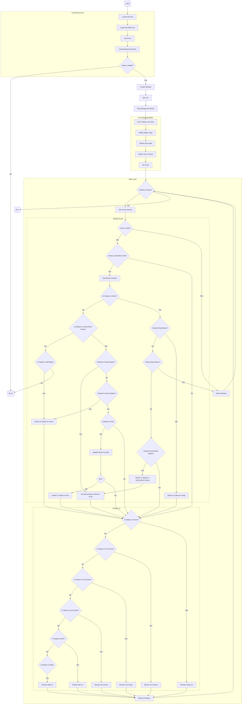

```mermaid
flowchart TB
    Start(Start)
    Error(Error)
    Exit(Exit)
    
    subgraph TB LoadResources["Load Resources"]
        L1["Load Arial Font"]
        L2["Load Arial Bold Font"]
        L3["Load Icon"]
        L4["Load Background Music"]
        L5{"Music Loaded?"}
        L1 --> L2 --> L3 --> L4 --> L5
    end
    
    A["Create Window"]
    B["Set Icon"]
    C["Play Background Music"]
    
    subgraph TB GBV["Init Global Variables"]
        G1["Init UI Status as Home"]
        G2["Define Matrix Data"]
        G3["Define Rule Data"]
        G4["Define Timer Cache"]
        G5["Init Timer"]
        G1 --> G2 --> G3 --> G4 --> G5
    end
    
    subgraph TB ML["Main Loop"]
        M1{"Window is Open?"}
        M2["Get Current Event"]
        M3["Refresh Window"]
        M4["Close Window"]
        subgraph TB HE["Handle Event"]
            H1{"Event is Quit?"}
            H2{"Mouse Left Button Click?"}
            H3["Get Mouse Position"]
            H4{"UI Status is Home?"}
            H5{"UI Status is 3x3/4x4/5x5 Game?"}
            H6{"UI Status is Win/Help?"}
            H7["Switch UI Status to Home"]
            H8["Switch UI Status to 3x3/4x4/5x5 Game"]
            H9["Init Game Matrix & Rule & Timer"]
            H10["Update Matrix by Rule"]
            H11{"Clicked in Reset Button?"}
            H12{"Clicked in Grid?"}
            H13{"Clicked Help Button?"}
            H14{"Clicked Quit Button?"}
            H15{"Clicked in Home Button?"}
            
            H16{"Clicked 3x3/4x4/5x5 Button?"}
            H17{"Win?"}
            H18["Switch UI Status to Win"]
            H19["Switch UI Status to Help"]
            
            H1 -->|NO| H2 -->|Yes| H3 --> H4 -->|No| H5 -->|No| H6 -->|Yes| H7
            H4 -->|Yes| H13 -->|No| H14 -->|No| H16
            H13 -->|Yes| H19
            H11 -->|Yes| H9
            H16 -->|Yes| H8 --> H9
            H15 -->|Yes| H7
            H5 -->|Yes| H11 -->|No| H15 -->|No| H12 -->|Yes| H10 --> H17 -->|Yes| H18
        end
        
        subgraph TB UI["Render UI"]
            U1{"UI Status is Home?"}
            U2{"UI Status is 3x3 Game?"}
            U3{"UI Status is 4x4 Game?"}
            U4{"UI Status is 5x5 Game?"}
            U5{"UI Status is Win?"}
            U6{"UI Status is Help?"}
            U7["Render Home UI"]
            U8["Render 3x3 Game"]
            U9["Render 4x4 Game"]
            U10["Render 5x5 Game"]
            U11["Render Win UI"]
            U12["Render Help UI"]
            
            U1 -->|No| U2 -->|No| U3 -->|No| U4 -->|No| U5 -->|No| U6
            U1 -->|Yes| U7
            U2 -->|Yes| U8
            U3 -->|Yes| U9
            U4 -->|Yes| U10
            U5 -->|Yes| U11
            U6 -->|Yes| U12
            
        end
        M3 --> M1
        H7 & H9 & H18 & H19 --> U1
        H12 & H16 & H17 -->|No| U1
        H2 -->|No|U1
        U7 & U8 & U9 & U10 & U11 & U12 --> M3
        H14 -->|Yes| M4
        H1 -->|YES| M4 --> M1
        M1 --> M2 --> H1
    end
    
    Start --> L1
    L5 & H6 -->|No| Error
    M1 -->|No| Exit
    L5 -->|Yes| A --> B --> C --> G1
    G5 --> M1
    
```