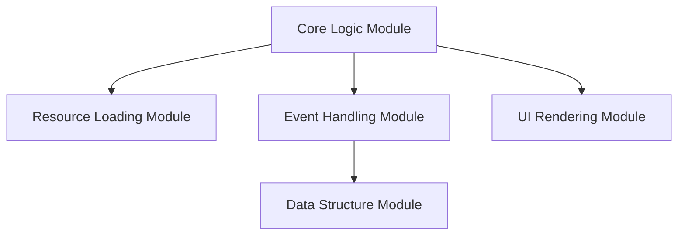

```mermaid
flowchart TB
    A["Core Logic Module"]
    B["Resource Loading Module"]
    C["Event Handling Module"]
    D["UI Rendering Module"]
    E["Data Structure Module"]
    
    A --> B & C & D
    C --> E
```